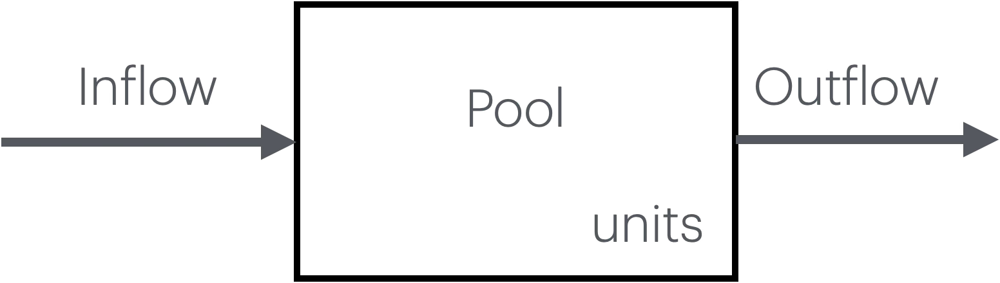

# Simple Budgets {#simple-budgets}

This chapter concerns one and two compartment models with constant fluxes. 

## Learning Objectives

- use simple 1- and 2-compartment models to track and predict fates of elements.
-	use zero-th order equations to represent inflows and outflows (fluxes) that are constant.
- calculate rates of change of mass in compartments, time to events, and make predictions about future states.

**Key concepts**

Read these now, but apply them later as you work through the examples. Don't sweat these too much to start. They will make more sense as you work through the examples.

1. Transfer fluxes appear as negative terms in the source compartment and positive terms in the receiving compartment
2. External inputs only appear in equations for compartments directly receiving them
3. External outputs only appear in equations for compartments directly losing them
4. The sum of changes across all compartments equals net system input minus net system output
5. A compartment can have dN/dt = 0 (steady state) even if the system as a whole is not at steady state


**A general template for a one compartment model**

```{r one, fig.cap="A one compartment model.", out.width="50%", fig.align='center', echo=FALSE}


```

For a one-compartment model of element $X$, the rate of change in the mass of $X$ is
$$\frac{dX}{dt} = F_{in} - F_{out}$$

where flux units must match, for instance, units($F_{in}$) $= \mathrm{kg\cdot y^{-1}}$, or kilograms per year.

## One-compartment models

### Example 1: Lake Phosphorus

A small lake receives phosphorus from:

- Upstream inflow: 5 kg P/day
- Loss via outflow: 3 kg P/day

Calculate: What is the rate of change of phosphorus in the lake (dP/dt)?

### Example 2: Forest Floor Leaf Litter

A forest floor accumulates and loses leaf litter at constant rates:

- Litterfall input: 400 g C/m²/year
- Decomposition output: 350 g C/m²/year

Calculate: What is the rate of change of carbon in the litter layer (dC/dt)? If the litter layer currently contains 2000 g C/m², how much will it contain after 10 years?


### Example 3: Pond Water Budget

A pond has the following water fluxes:

- Groundwater inflow: 1200 L/day
- Evaporation: 800 L/day
- Stream outflow: 500 L/day

Calculate: What is the net rate of change of water volume in the pond (dV/dt)? Is the pond filling or draining?

### Example 4: Soil Nitrogen Pool

A soil nitrogen pool has:

- Atmospheric deposition + fertilizer: 12 g N/m²/year
- Plant uptake + leaching: 15 g N/m²/year

Calculate: What is dN/dt? If the soil currently has 450 g N/m², what will it have in 5 years?


## More complex one-compartment models

### Example 5: Estuary Nitrogen Cycling

An estuary has the following nitrogen fluxes:

- River input: 850 kg N/day
- Atmospheric deposition: 45 kg N/day
- Denitrification to atmosphere: 320 kg N/day
- Ocean exchange (net export): 480 kg N/day
- Burial in sediments: 60 kg N/day

a. Calculate the rate of change of nitrogen in the water column (dN/dt)
a. Is the system at steady state? If not, is nitrogen accumulating or being depleted?
a. If the estuary currently contains 12,000 kg N, how long until it reaches 13,000 kg N (assuming constant fluxes)?

### Example 6: Tropical Forest Carbon Balance

A 1-hectare tropical forest plot has the following carbon fluxes (all in Mg C/ha/year):

- Gross primary production (photosynthesis): 32.5
- Autotrophic respiration: 18.0
- Heterotrophic respiration: 13.8
- Wood harvest removal: 0.3

a) Calculate net primary production (NPP = GPP - autotrophic respiration)
b) Calculate the rate of change of total carbon in the forest (dC/dt)
c) The plot currently stores 220 Mg C/ha. How much will it store after 20 years?
d) Short answer: What would cause this system to reach equilibrium?

### Example 7: Urban Stormwater Detention Basin

A stormwater basin (volume capacity = 50,000 L) manages runoff with these fluxes:

- Inflow during rain event: 2,400 L/hour
- Infiltration to groundwater: 900 L/hour
- Evaporation: 100 L/hour
- Controlled outlet flow: 1,200 L/hour

a) Calculate dV/dt during the rain event
b) If the basin starts empty, how many hours until it reaches 30,000 L?
c) After the rain stops (inflow = 0), what is the new dV/dt?
d) How long to drain from 30,000 L to 5,000 L after rain stops?

## Two-compartment models


### General Template for Two-Compartment Models

With two compartment models, we conceive of this two compartment system as one entity. 

```{r two, fig.cap="A two compartment model. Here we distinguish the one system as having two internal compartments. Each compartment may have fluxes coming from outside the system, as well as fluxes from one compartment to the other.", out.width="67%", fig.align='center', echo=FALSE}
knitr::include_graphics("figs/two_compartments.png")
```

We now have a system with both internal transfers from one compartment, $X$, to another, and to and from outside the system.

For each compartment, we have,

$$\frac{dX_1}{dt} = F_{in1} - F_{2,1} - F_{out1}$$
$$\frac{dX_2}{dt} = F_{in2} + F_{2,1} - F_{out2}$$

There are many conventions for labelling fluxes and model parameters. They can typically be understood by the context. Here, we have used a subscript with *in* or *out* to indicate a flux that moves material between a compartment and the world that is external to our system. 

Here we use a numbering system for $F_{2,1}$ that we should read as "into compartment 2 from compartment 1". You might have guessed that based on the signs (+,-) of the fluxes in the equations. 

For the entire system, we only have to consider the external inputs and outputs; we can ignore the internal fluxes between compartments. We can demonstrate this by summing the compartments:


$$\frac{dX_1}{dt} + \frac{dX_2}{dt} = (F_{in1} - F_{2,1} - F_{out1}) + (F_{in2} + F_{2,1} - F_{out2})$$
$$\frac{dX_1}{dt} + \frac{dX_2}{dt} = F_{in1} + F_{in2} - F_{2,1} + F_{2,1} - F_{out1}  - F_{out2}$$
$$\frac{dX_1}{dt} + \frac{dX_2}{dt} = F_{in1} + F_{in2} - F_{out1}  - F_{out2}$$


### Example 8: Soil-Groundwater Nitrogen System

A watershed has two connected nitrogen pools:

COMPARTMENT 1: Soil Nitrogen Pool (N_soil)

- External input (atmospheric deposition + fertilizer): 15 g N/m²/year
- Plant uptake (loss from soil): 8 g N/m²/year
- Leaching to groundwater: 4 g N/m²/year

COMPARTMENT 2: Groundwater Nitrogen Pool (N_gw)

- Input from soil leaching: 4 g N/m²/year
- Output to stream (loss from system): 3.5 g N/m²/year

Questions:

a) Draw a box-and-arrow diagram of this system showing both compartments and all fluxes
b) Write the differential equation for dN_soil/dt
c) Write the differential equation for dN_gw/dt
d) Calculate the rate of change for each compartment
e) Is either compartment at steady state?
f) What is happening to the total nitrogen in the entire system (soil + groundwater)?
g) If the soil pool currently contains 800 g N/m² and groundwater contains 50 g N/m², what will each pool contain after 10 years?

### Example 9: Vegetation-Litter Carbon System


A grassland ecosystem has two connected carbon pools:

COMPARTMENT 1: Living Vegetation (C_veg)

- External input (net photosynthesis): 850 g C/m²/year
- Herbivory (loss from system): 120 g C/m²/year
- Senescence/litterfall to litter layer: 680 g C/m²/year

COMPARTMENT 2: Litter Layer (C_litter)

- Input from vegetation senescence: 680 g C/m²/year
- Decomposition/respiration (loss from system): 620 g C/m²/year

Questions:

a) Draw a box-and-arrow diagram of this system showing both compartments and all fluxes
b) Write the differential equation for dC_veg/dt
c) Write the differential equation for dC_litter/dt
d) Calculate the rate of change for each compartment
e) Is either compartment at steady state?
f) Calculate the rate of change for the total carbon in the system (vegetation + litter)
g) The vegetation currently contains 450 g C/m² and the litter layer contains 1,200 g C/m². What will each pool contain after 5 years?
h) After 5 years, what proportion of the total system carbon is in each compartment?


## Answers

**Example 1: Lake Phosphorus**

- dP/dt = F_in - F_out = 5 - 3 = 2 kg P/day
- The lake is accumulating phosphorus

**Example 2: Forest Floor Leaf Litter**

- dC/dt = 400 - 350 = 50 g C/m²/year
- After 10 years: N(10) = 2000 + (50 × 10) = 2,050 g C/m²

**Example 3: Pond Water Budget**

- dV/dt = 1200 - 800 - 500 = -100 L/day
- The pond is draining (losing water)

**Example 4: Soil Nitrogen Pool**

- dN/dt = 12 - 15 = -3 g N/m²/year
- After 5 years: N(5) = 450 + (-3 × 5) = 435 g N/m²


**Example 5: Estuary Nitrogen**

a) dN/dt = (River + Deposition) - (Denitrification + Ocean export + Burial) = (850 + 45) - (320 + 480 + 60) = 895 - 860 = 35 kg N/day

b) Not at steady state (dN/dt ≠ 0); nitrogen is accumulating in the water column

c) Time to gain 1,000 kg N:
   Δt = ΔN / (dN/dt) = 1,000 / 35 = 28.6 days (approximately 29 days)


**Example 6: Tropical Forest Carbon**

a) NPP = GPP - autotrophic respiration = 32.5 - 18.0 = 14.5 Mg C/ha/year

b) dC/dt = NPP - heterotrophic respiration - harvest
   dC/dt = 14.5 - 13.8 - 0.3 = 0.4 Mg C/ha/year

c) After 20 years: C(20) = 220 + (0.4 × 20) = 228 Mg C/ha

d) Equilibrium when dC/dt = 0, which would require any combination where total outputs = 14.5. For instance,

   NPP = heterotrophic respiration + harvest
   
   14.5 = 13.8 + 0.3 + difference
   
Heterotrophic respiration would need to be 14.2 Mg C/ha/year instead of 13.8, or harvest would need to be 0.7 Mg C/ha/y.


**Example 7: Stormwater Basin**

a) During rain: dV/dt = 2,400 - 900 - 100 - 1,200 = 200 L/hour
b) Time to reach 30,000 L from empty:
   Δt = 30,000 / 200 = 150 hours

c) After rain stops: dV/dt = 0 - 900 - 100 - 1,200 = -2,200 L/hour

d) Time to drain from 30,000 L to 5,000 L:
   ΔV = 25,000 L
   Δt = 25,000 / 2,200 = 11.4 hours (approximately 11 hours 24 minutes)
   
**Example 8: Two compartment model of N**


```{r twoN, fig.cap="Answer for 8a. A two compartment model of soil N.", out.width="67%", fig.align='center', echo=FALSE}
knitr::include_graphics("figs/two_soil.png")
```


b) dN_soil/dt = (Atmospheric input) - (Plant uptake) - (Leaching to groundwater) = 15 - 8 - 4

c) dN_gw/dt = (Leaching from soil) - (Stream outflow) = 4 - 3.5

d) Calculations:
   
   dN_soil/dt = 15 - 8 - 4 = 3 g N/m²/year
   
   dN_gw/dt = 4 - 3.5 = 0.5 g N/m²/year

e) Neither compartment is at steady state (both have dN/dt ≠ 0)

   - Soil is accumulating nitrogen
   - Groundwater is also accumulating nitrogen

f) Total system change:

   d(N_total)/dt = dN_soil/dt + dN_gw/dt = 3 + 0.5 = 3.5 g N/m²/year
   
   Alternative calculation:
   
   d(N_total)/dt = Total inputs - Total outputs = 15 - (8 + 3.5) = 3.5 g N/m²/year
   
   The entire system is accumulating 3.5 g N/m²/year

g) After 10 years:

   N_soil(10) = 800 + (3 × 10) = 830 g N/m²
   
   N_gw(10) = 50 + (0.5 × 10) = 55 g N/m²
   
**Example 9: Grassland carbon pools**

a) Diagram should show:

   [Atmosphere] --850--> [VEGETATION] --680--> [LITTER] --620--> [Atmosphere]
                              |
                             120 (herbivory)
                              ↓
                         [Consumers]

b) dC_veg/dt = (Net photosynthesis) - (Herbivory) - (Senescence) = 850 - 120 - 680

c) dC_litter/dt = (Senescence input) - (Decomposition) = 680 - 620

d) Calculations:

   dC_veg/dt = 850 - 120 - 680 = 50 g C/m²/year
   
   dC_litter/dt = 680 - 620 = 60 g C/m²/year

e) Neither compartment is at steady state (both have dC/dt ≠ 0)

   - Vegetation is accumulating carbon at 50 g C/m²/year
   - Litter is accumulating carbon at 60 g C/m²/year

f) Total system change:

   d(C_total)/dt = dC_veg/dt + dC_litter/dt = 50 + 60 = 110 g C/m²/year
   
   Alternative calculation (system inputs - system outputs):
   
   d(C_total)/dt = 850 - (120 + 620) = 850 - 740 = 110 g C/m²/year
   
   The system is a net carbon sink, accumulating 110 g C/m²/year

g) After 5 years:
   
   C_veg(5) = 450 + (50 × 5) = 450 + 250 = 700 g C/m²
   
   C_litter(5) = 1,200 + (60 × 5) = 1,200 + 300 = 1,500 g C/m²

h) After 5 years: Total C = 700 + 1,500 = 2,200 g C/m²
   
   Proportion in vegetation = 700/2,200 = 0.318 (31.8%)
   
   Proportion in litter = 1,500/2,200 = 0.682 (68.2%)


