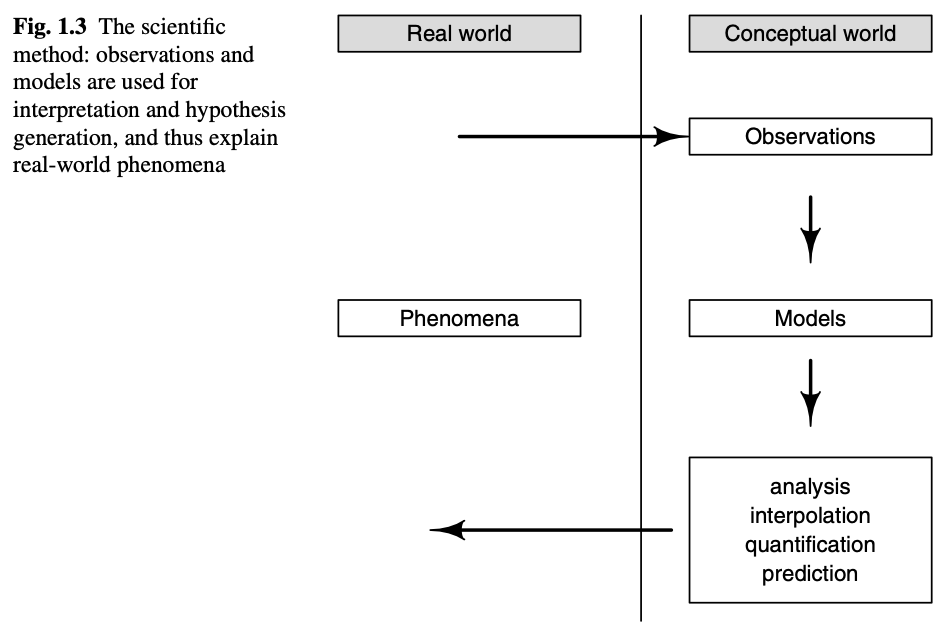
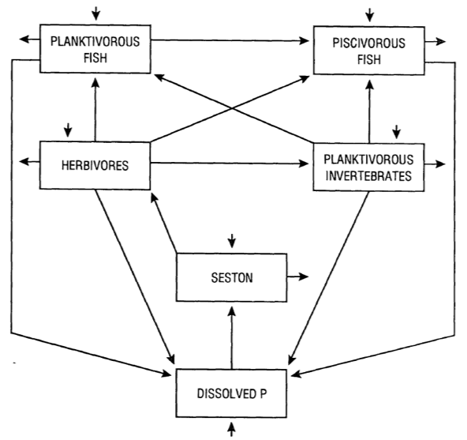
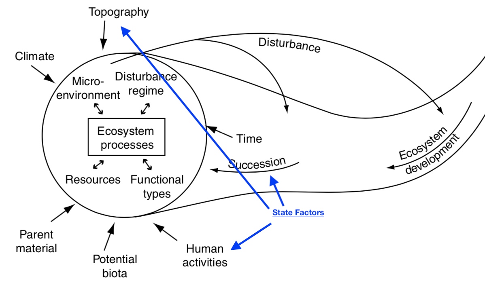
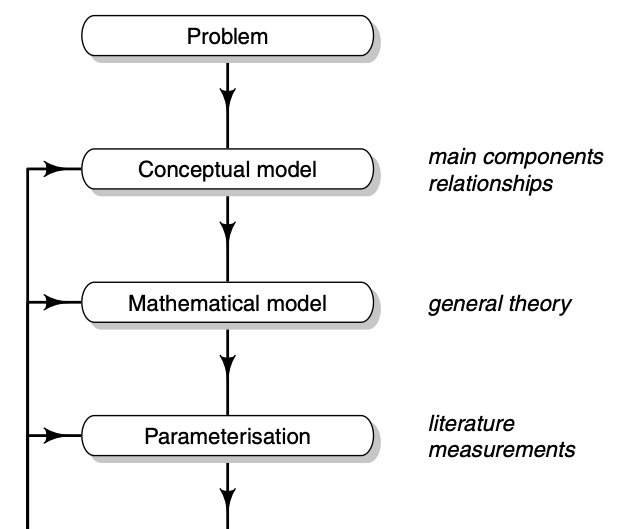
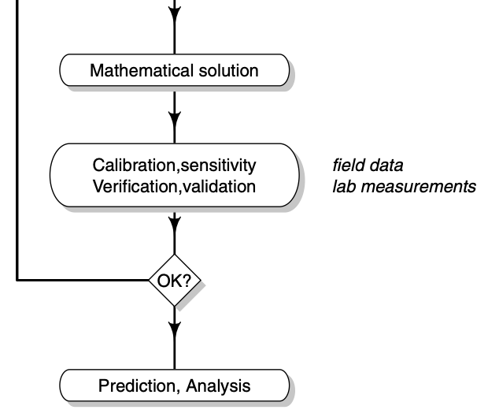

# Introduction ecosystem models - a work in progress {#intro}

Reading: 

* pp. 1-17, (Chapters 1, 2; Soetaert and Hermann 2009)

In this course, we'll cover the very basics of ecosystem modeling. There are several goals I have for you, the reader. I hope the you,

* become more fluent in the discipline of ecosystem ecology; that you understand and can use basic terminology, and can identify quantitative pieces of the literature you read, and presentations you hear and see;
* understand and describe the quantitative and qualitative features of ecosystem dynamics and models of those dynamics;
* assess the relative merits of different modeling approaches and different mathematical formalisms of those apporaches;
* create models of ecosystem dynamics of your own;
* write R code to implement ecosystem models.

To do all this, the following text relies heavily on selected secondary sources including @Soetaert2009 and @Haefner1996. I also cite selected primary soruces where appropriate.

## Why models?
In general, models are simplifications of reality. Useful models capture something useful about the reality we are interested in. A road map is a useful model of a road network. It captures just what we need. We model to aid understanding, because, at some level, the model is a quantitative and qualitative explanation for some phenomenon (Fig. \@ref(fig:SH1-3)). We can use models to test hypotheses, guide experiments, and predict manage ecosystems and populations [@Soetaert2009].

```{r SH1-3, echo=FALSE, fig.cap="*We use conceptual and mathematical models to interpret reality. (Fig. 1.3 in Soetaert and Hermann, 2009).*"}

```

## What's an ecosystem?
You can find definitions of an ecosystem elsewhere, but here we want to emphasize the abstraction of that ecosystem (Fig. \@ref(fig:lake)). We will think of an ecosystem as a set of one or more compartments containing some mass of an element of interest, such as carbon or nitrogen. That element is the *currency* of the ecosystem. These compartments (aka pools, stocks) are connected by *fluxes*, or flows, the transfer of some mass of the element. When these transfers come from outside the ecosystem entirely, we refer to them as *imports*. When the transfer exits the system entirely, we refer to it as an *exports*. 
```{r lake, echo=FALSE, fig.cap="*An ecosystem perspective of lake, in terms of phosphorus [@Carpenter1992]. Boxes are ecosystem compartments and the quantities are pools (a.k.a. stocks, units are mass per unit area or volume). Arrows are fluxes (units are mass per unit time.*"}

```

Ecosystem fluxes or flows are influenced by *state factors* such as temperature, time, or disturbance which act as constraints that can limit or speed up the fluxes or determine the current states of the variables (Fig. \@ref(fig:statefactors)). 

```{r statefactors, echo=FALSE, fig.cap="*The current state of an ecosystem depends on state factors [@Chapin2002].*"}

```

We can describe an ecosystem as a set of pools or compartments, connected by fluxes, that is, transfers of energy or materials among pools.

In Fig. \@ref(fig:lake), all pools are receiving imports from outside the system, represented by arrows coming from the amorphous cloud. All pools save dissolved P appear to export P back out. Dissolved P is receiving fluxes from all the animals in the system, and losing P to seston, which is primarily phytoplankton.

## What's a model?
You've already seen ecosystem models. An ecosystem model consists of the compartments and fluxes we saw above. We refer to the currencies in different compartments as *variables* because they can vary or change through time. We use mathematical equations and computational controls to represent fluxes between compartments. In the equations, there are constants that we call *parameters* that control the rate of these fluxes. 

We describe an ecosystem using *balance* equations for each pool. A balance equation is simply a bookkeeping or budgeting device to keep track of fluxes:

$$\mathrm{Change~in~pool} = \mathrm{Sources - Sinks}$$
As models increase in complexity, we usually use differential equations, or time derivatives, to represent the balance equation for each pool or state variable in a model. For instance, the dissolved P in Fig. \@ref(fig:lake) might look like
$$\frac{dD}{dt} = I + e_HH + e_N N + e_1 F_1 + e_2 F_2 - u_SS$$
where $D$ is the amount of P in the dissolved pool, perhaps in mg m$^{-2}$, $I$ is import, or source, from outside the system (dust? lake inflow?), and $H$, $N$, $F_1$, and $F_2$ are the other pools. The lower case letters are *parameters* or rate constants that are the mass-specific fluxes. 

The units of $dD/dt$ are mg m$^{-2}$ d$^{-1}, and so **each term (e.g., $I$ or $e_H H$) in the equation must also have these same units**. 

* units of $e_H H$ must be mg m$^{-2}$ d$^{-1}$.
* units of $H$ are mg m$^{-2}$.
* Ergo, units of $e_H$ are d$^{-1}$.

More intuitively, the units of these rate constants are mg m$^{-2} d$^{-1}$ per mg m$^{-2} in the lake. Note the quantities cancel out, and we are left with d$^{-1}$.

See @Soetaert2009 section 2.1.4 for further explanation. 

One nice feature of ecosystem ecology and ecosystem models is the emphasis on the conservation of mass and energy. We aim to track where everything comes from and where it goes. If we add up all of the rates of change for each pool, we should see that most of them concel out, and we are left with only imports and exports. Doing this summation will tell us whether our model makes sense or we made a mistake. If we did not make any mistakes, it will tell us whether the entire system is a net sink or source of our currency. For instance, after simplifying the lake ecosystem model, we would have, 
$$\frac{dD}{dt} + \frac{dS}{dt} + \frac{dH}{dt} + \frac{dN}{dt} + \frac{dF_1}{dt} + \frac{dF_2}{dt} = \ldots \ldots = \mathrm{Imports - Exports}$$

See @Soetaert2009 section 2.1.3 for further explanation. 

State factors also enter into the model, typically altering the fluxes. For instance, increasing atmospheric temperature might force a predictable change in our rate constants (e.g., $e_H$, $u_S$) in the above model. Because temperature is an external factor forcing a change to a parameter, we often call its role in a model a *forcing function.*

To review: variables are quantities that change with time, such as the amount of carbon in the atmosphere, or the amount of phosphorus in the primary producers in a lake. Parameters are (typically) constants in equations that quantify how quickly the variables change. Forcing functions represent state factors that we think of as external to the ecosystem compartments.

No models apply everywhere, all the time. All models are limited for a specific *domain* and with specific *boundaries*. These are the spatial, temporal and conceptual limits on a model. 

### Other ideas
Statistical models (e.g., regression) are concerned with describing patterns and hypothesis testing. Process models (e.g., stock and flow models) are also descriptions of natural systems, but they include more mechanism and seek to describe mechanism and understand process. People sometimes call these *mechanistic* models.

```{r anpp, echo=FALSE, fig.cap="*A statistical model of aboveground plant biomass as a function of available soil nitrogen.*" }
Soil_N <- runif(100, .1, 2.1)
Abovegrd_plant_biomass <- Soil_N * .5 + Soil_N*rnorm(length(Soil_N), sd=.1)
qplot(Soil_N, Abovegrd_plant_biomass, geom=c("point") ) + geom_smooth(method = "lm")
```

A *theory* is a well supported hierarchical framework that contains clearly formulated postulates, based on a minimal set of assumptions, from which a set of predictions logically follows [@Marquet2014]. *Efficient* theory is based to as much as possible on first principles, and relies on as few assumptins as possible.

In contrast to theory, models are specific implementations of theory and specific descriptions of nature. Remember that in principle, *all models are wrong, but some are useful*^[Box, G. E. P. (1979), "Robustness in the strategy of scientific model building", in Launer, R. L.; Wilkinson, G. N., Robustness in Statistics, Academic Press, pp. 201–236.].

**Exercise:** Ask yourself whether a lake is a carbon sink or a source. Draw an appropriate compartment model to address this question. After having done so, ask yourself what assumptions you've made about the temporal and spatial scales. What mechanisms have you included? Why?

## Steps in modeling
@Soetaert2009 identify a series steps that guides model development and ultimately improve understanding and prediction (Fig. \@ref(fig:SH1-7)).
```{r SH1-7, echo=FALSE, fig.cap="*It is helpful to use a series of steps in improving our models. (Figure 1.7 in Soetaert and Hermann, 2009).*", fig.show='hold', out.width='45%'}


```

## An example in R

Here we create a simple model to illustrate some of what we've been describing.

Consider our lake above, as a whole. We'll let the imports, $I$, be constant and independent of the amount of the P in the lake. Our exports will depend on the amount of the P in the system-the more P in the system, to more can be exported, that is, a constant fraction, $a$, is exported,
$$\frac{dP}{dt} = I - a P$$
In R, we write a function for the system of differential equations.
```{r}
lake <- function( time, state_vars, parameters ){
  P <- state_vars[1] # state variable(s)
  with(as.list(parameters), # tell R to look inside 'parameters'
       {
         dP.dt <- I -a*P # the balance eq. or rate func.
         return(list(dP.dt)) # return the value of the rate function
       })
}
```

Next, we tell R what the values of the parameters are that we want. Let's say the the import is 3 mg m$^{-2}$ d$^{-1}$, and that the fraction (or rate, really) is 0.5 d$^{-1}$, or more intuitively, mg m$^{-2}$ d$^{-1}$ per mg m$^{-2}$ in the lake. Note the quantities cancel out, and we are left with d$^{-1}$.
```{r}
p <- c(I = 10, a = .5)
```

Now the exciting part. We tell R our starting point and what time points we want to integrate for, and then *solve* the differential equation and have R return the result for the time points we want. After that, we display the first five time points.
```{r}
initial.state <- c(P=1)
t <- seq(from=0, to=10, by=1/24) # 10 days, in hourly increments
out <- ode(y=initial.state, times = t, func = lake, parms = p)
out[1:5,]
```

Pictures are informative, so here we plot the result.
```{r}
plot(out)
```

In very simple situations, we can solve the equilibrium by hand. By definition, the equilibrium is a state at which the system stops changing, that is, its rate of change is zero. To find a value of $P$ which is an equilibrium, we set the balance equation equal to zero, and solve for $P$:
$$\frac{dP}{dt} = 0 = I -aP$$
$$P^* = \frac{I}{a}$$
By convention, we denote the equilibrium value of $P$ with an asterisk, or "star", as in "P-star". We call this the *analytical solution*.

*Questions:*

* Is our graph consistent with the analytical prediction of $P^*$?
* Determine the units of $I$ and $a$; show your work and explain it to your cat.

In more complex systems, we often (typically?) can't solve for the analytical solution. Instead, we usually run a model for a long period of time, until the state variables stop changing to find the same result. Alternatively, if we have a model of a real ecosystem, we made be interested in its short term dynamics and address any number of questions related to experimental results, making predictions about the consequences of landscape management, or or using a time series to compare different models.


