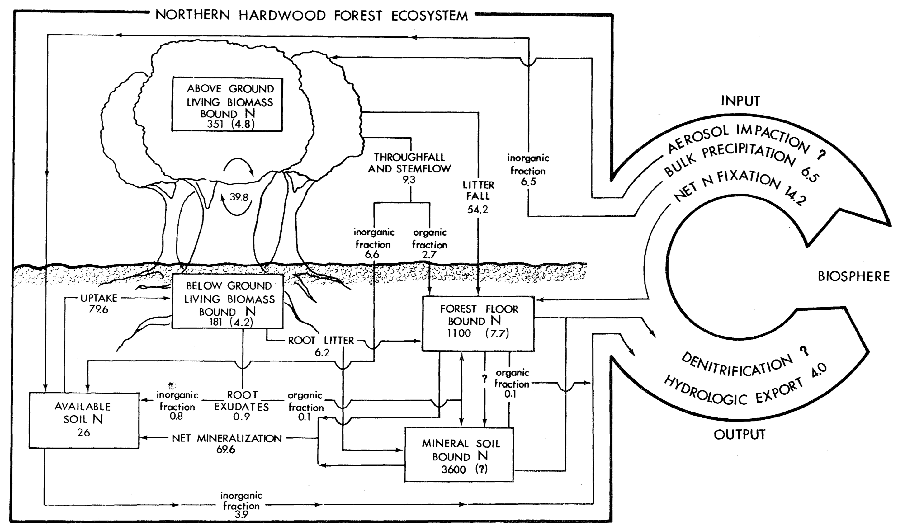

# Describing a nitrogen budget {#N}

Background Readings:

* pp. 17-35 (Soetaert and Hermann 2009)
* Bormann et al. 1977. Nitrogen Budget for an aggrading northern hardwood forest ecosystem. *Science* 196:981-983.

```{r hbnb, echo=FALSE, fig.cap="*Nitrogen budget for a temperate northern hardwood forest (Hubbard Brook Watershed 6, Bormann et al. 1977).*", out.width = '100%'}

```

```{r hbnb3, echo=FALSE, fig.cap="*A simpler compartment model for Hubbard Brook Watershed 6, based on Bormann et al. (1977).*"}

```

## Getting started

1. (S&H 15-17) For any ecosystem, we want to start with paper and pencil and **sketch out the pools and the fluxes** that we think are important (see example, Fig. \@ref(fig:hbnb3)). Don't sweat the details yet -- you'll revise it anyway. Go ahead an label the compartments and the fluxes with with both biological and physical processes as well as some simple abstract notation.

2. **Write balance equations** (S&H, 3, 17-20). For each flux, identify the underlying biological and physical processes. If you don't completely know, don't sweat it. Here are the balance equations for Fig. \@ref(fig:hbnb3):

Rate of change of vegetation = uptake - exudates and through fall - leaf and root litter loss 
$$\frac{dV}{dt} = f_1 - f_2 - f_3$$

Rate of change in available pool in soil solution = bulk precip + exudates and through fall + net mineralization - uptake - stream export
$$\frac{dA}{dt} = I_1 + f_2 + f_4 - f_1 - E_1$$

Rate of change in the bound pool = net N fixation + leaf and root litter loss - net mineralization - stream export
$$\frac{dB}{dt} = I_2 + f_3 - f_4 - E_2$$

3. Assess the total load or mass budget (S&H, 19-22). For Fig. \@ref(fig:hbnb3), we have 
$$\frac{d\left(V+A+B\right)}{dt} = \frac{dV}{dt} + \frac{dA}{dt} + \frac{dB}{dt} = (f_1 - f_2 - f_3) + (I_1 + f_2 + f_4 - f_1 - E_1) + (I_2 + f_3 - f_4 - E_2)$$
$$\frac{d\left(V+A+B\right)}{dt} = I_1 + I_2 + f_1 - f_1 + f_2 - f_2 + f_3 - f_3  + f_4 - f_4 - E_1 - E_2$$

$$\frac{d\left(V+A+B\right)}{dt} = I_1 + I_2 - E_1 - E_2$$
From this we see that the total mass budget for this watershed depends simply on import or inputs, and exports or outputs.

3. For each flux, **decide which pools directly influence the flux**. In  a forest, the flux of nitrogen from vegetation to soil will depend enormously on the amount of vegetation present as leaves senesce and fall, fine roots die back, and water leaches nutrients out of leaves and bark. The flux is very unlikely to depend directly on the amount of nitrogen already in the soil. In a lake, the flux of phosphorous from the water column into phytoplankton depends on the amounts of both the amount of phytoplankton and the amount of phosphate in the water at any given instant.

For the vegetation pool in Fig. \@ref(fig:hbnb3), we see each flux ($f$) is a *Function* ($F()$) of one or two pools:

* Uptake: $f_1 = F(V,A)$
* Leaf and root litter, and  throughfall: $f_3 = F(V)$
* Root exudates, and throughfall: $f_4 = F(V)$

Next, we want to represent these fluxes in a mathematical form.

## Mathematical forms

A common starting point for dynamics depending on two pools is the law of *mass action*. This states that the reaction rate is proportional the product of the pools. In the case of plant uptake of N, which depends on the amounts of N in the available pool and the vegetation pool, this would be $aVA$, where $a$ is a proportionality constant. In some circumstances, these pools might also have exponents different than one ($aV^1A^1$), such as $aVA^2$. This occurs in chemistry when a reaction requires two molecules of "A" for each molecule of "V". It might occur in ecology if a rate depends differentially on A and B. 

Using the law of mass action for plant uptake, we will describe the fluxes in the simple N budget above (Fig. \@ref(fig:hbnb3)) with the following expressions. 

\begin{align}
\frac{dV}{dt} &= a_{1}AV - a_{2}V - a_3 V\\
\frac{dA}{dt} &= I_1 + a_{2}V +  a_{4}B - a_{5}A - a_{1}AV\\
\frac{dB}{dt} &= I_2 + a_{3}V - a_{4}B - a_{6}B
\end{align}

Take the time to identify each term and think about the biology or physics that might govern each term.

## Paramaterization
Parameteriztion is what we call assigning numerical values to mathematical parameters. Here, we find initial estimates for the parameters in our model. We use the literature for this purpose [@Bormann1977].

If we have the data (we do) and relatively simple mathematical forms
(we do), it is fairly straightforward to estimate parameters. For
instance, we decided that net mineralization would be directly
proportional to the size of the organic pool, $B$, that is, $F_4 =
a_4B$. To calculate the annual incremental rate $a_4$, we substitute data where we can, and solve what we need. 
\begin{align*}
  F_4 &= a_4 B\\
  69.6 &= a_4 B\\
  a_4 &= \frac{69.6}{4700}\\
  a_4 &\approx 0.0148
\end{align*}

We use the same approach for second order equations as well. 
\begin{align*}
  F_1 &= a_1 AV \\
  79.6 &= a_1  26\cdot 532  \\
  a_1 &= \frac{79.6}{26\cdot 532}\\
  a_1 &\approx 0.0058
\end{align*}

To create instantaneous rates, we take advantage of a result from calculus. It turns out that the natural logarithm of the ratio of masses gives us an estimate of an average instantaneous rate.

Let $B_0$ be the mass of N in the soil at time 0, and $B_1$ would be the mass one year later if we summed $B$ plus the flux coming out of $B$:
$$B_0=4700 \quad; \quad B_1 = B_0 + F_4 = 4700 + 69.6$$
The average instantaneous rate, $\alpha_4$ required to get us from $B_0$ to $B_1$ in one year is
$$\alpha_4 = \log\left(\frac{B_1}{B_0}\right) =  \log\left(\frac{4700+69.6}{4700}\right) \approx 0.0147$$

If you compare the annual incremental rate we first calculated to this instantaneous rate, you can see they are quite similar. They would be indistinguishable given the other uncertainties in actually estimating these fluxes and pools. However, that is not always the case.


```{r echo=FALSE}
labels <- c("$A, B, V$ state variables", "$a_1$, uptake rate by V from A ", "$a_2$, loss rate from V to A ", "$a_3$, loss rate from V to B", "$a_4$, mineralization", "$a_5$, export from A", "$a_6$, export from B","$I_1$, bulk precip", "$I_2$, N fixation")

unit <- c("kg ha$^{-1}$", " (kg ha$^{-1}$)$^{-1}$ y$^{-1}$", "y$^{-1}$", "(kg ha$^{-1}$)$^{-1}$ y$^{-1}$", "y$^{-1}$", "y$^{-1}$", "y$^{-1}$", "kg ha$^{-1}$ y$^{-1}$", "kg ha$^{-1}$ y$^{-1}$")

est <- c("$26, 4700, 532$", "$\\log( (79.6+26 \\cdot 532) / (26 \\cdot 532) ) = 0.0057$", "$\\log( (6.6 + 0.8 + 532) / 532 ) = 0.014$", "$\\log( (54.2 + 2.7 + 0.1 + 6.2 + 532) / 532) = 0.011$", "$\\log( (69.6 + 4700) / 4700) = 0.0147$", "$\\log( (3.9 + 26) / 26) = 0.14$", "$\\log( (0.1 + 4700)/4700) = 0.000021$", "$6.5$", "$14.2$")

df <- data.frame("p or V" = labels, units=unit, Estimate=est )
kbl(df, caption="Instantaneous rate parameters, variables, units and estimates for a simplified model of Bormann et al. (1977). All fluxes ($dX/ dy$) are in units of kg ha$^{-1}$ y$^{-1}$. Note that calculations should not be included in your final table, but are presented here for clarity and comparison to your own calculations. Also, note that different rates are presented with different signifcant figures; this is not intended to represent best practice, as we do not now the precision of the data we are using. In any model, we will always estimate different parts with different degrees of precision.", align = c("l","c","c"), escape=FALSE)
```

Enter parameters into R. 

```{r}
params <- c( 
  i1 = 6.5, # precip
  i2 = 14.2, # fixation
  a1 = log( (26*532+79.6) / (26 * 532)), # uptake
  a2 = log( (6.6 + 0.8 + 532) / 532 ), # throughfall and inorganic exudates
  a3 = log( (54.2 + 2.7 + 0.1 + 6.2 + 532 ) / 532), # litter, throughfall, organic exudates
  a4 = log( (69.6+4700) / 4700), # net mineralization
  a5 = log( (3.9+26) /26 ), # export from available
  a6 = log( (0.1+4700) /4700) #export from bound
) # close parentheses

params
``` 

## Mathematical solution
The *mathematical solution* is the process of making the
predictions using our model and our parameters. We *solve* the
model. With simple models, we can sometimes find analytical
solutions. For most ecosystem models, we have to solve the models
numerically using *numerical integration*.

Here we write a function that includes our system of differential
equations. This will allow R to integrate change through time.
```{r b1}
bormann1 <- function(t, y, p) {
  # time, vector of state variables and parameters must be in this order
  # we can use as.list for both the state variables and parameters
  # a1 = uptake
  # a2 = loss from veg to avail
  # a3 = loss from veg to bound
  # a4 = net mineralization
  # a5 = export from avail
  # a6 = export from bound
  with( as.list( c(y, p) ), {
    dV.dt <- a1 * A * V - a2 * V - a3 * V
    dA.dt <- i1 + a2 * V + a4 * B - a1 * A * V - a5 * A 
    dB.dt <- i2 + a3 * V - a4 * B - a6 * B 
    # Here we return a LIST whose first element is the vector of
    # rates of change for the state variables. The first element must be these rates,
    # in the same order as the state variables in y
    # The second element, total, is the total N in the system
    return(list( c(dV.dt, dA.dt, dB.dt), 
                 total = V + A + B 
                 )  )})
}
```

Now that we have the function, we tell R what to do with it. We will define the *initial state of the system*, and then tell R which time point we want it to return.

The initial state of the system is the set of starting values for the state variables. We could choose any values, but I select the values given in @Bormann1977.
```{r}
## starting values in kg/ha
initial.state <- c( V = 532, A = 26, B = 4700)
```

Finally, let's solve the system, and have R return the first 20 years.
```{r fig.fullwidth=TRUE}
time <- 0:20
out <- ode(y = initial.state, times=time, func=bormann1, parms = params)
head(out) # the first 6 lines
```

Use `pivot_longer()` and `ggplot()` to make a graph. We use `pivot_longer()` gather multiple columns into one with a new name (`values_to=kg.N`), keeping track of the names of the original columns in a new column (`names_to=State.var`). We can use `pivot_wider()` if we ever want to spread those columns back out. 
```{r fig.cap="Dynamics of a simple N budget, based on Bormann et al. (1977)."}
outL <- out %>% # select the data set
  as.data.frame() %>%  # make sure it is a data frame and not a matrix
  ## and the rearrange
  pivot_longer( cols=-time, names_to="State.var", values_to="kg.N")

## plot the dynamics
ggplot(outL, aes(x=time, y=kg.N)) + # select variables to plot
  geom_line() + # select the form of the graph
  facet_wrap(~State.var, scale="free_y") # separate each state variable and plot each on its on scale.
```

In some ways, we have been moderately successful in our first pass at
converting a purely budgetary model into a dynamic process model. We
mimicked total load, and see similar changes through time of all the
state variables.

**Questions to ponder**

We replicated approximately the N budget of Bormann et al. (1977), but
clearly vegetation cannot keep accumulating N indefinitely.

What are our next steps? 


## Add self-limitation
One logical step is to assume that as vegetation eventually gets limited by some factor or resource that is not in our model. If, at first approximation, the vegetation reaches a carrying capacity independent of high resource availability, we can use an approximation suggested by Soetaert and Hermann (2009) for *self-limitation*,
$$f(X)V\left(1-\frac{V}{K}\right)$$
where $f(X)$ is everything else that regulates mass-specific growth rate.

**Exercise**

Include self-limitation in your model of vegetation, estimate $K$, and produce output.

Remember that following our template,  we have a maximum rate times resource and self limitation, and inhibition. Currently, we have
$$\frac{dV}{dt} = a_{1}AV - a_{2}V - a_3 V$$
and rearranging,
$$\frac{dV}{dt} = \left(a_{1}A - a_{2} - a_3\right) V$$
If we add self-limitation, we get
$$\frac{dV}{dt} = \left(a_{1}A - a_{2} - a_3\right) V \left(1-\frac{V}{K}\right)$$
where $K$ is the maximum amount of live vegetation that the ecosystem can sustain, in kg\,N\,ha$^{-1}$. We don't know exactly what that is yet, but we may be able to get estimates from the literature. For know we can pretend that it is just a bit more than was there in the mid-1970s, say, $K=600$. 

Now we rewrite the R function with self-limitation.
```{r b2}
bormann2 <- function(t, y, p) {
  # time, vector of state variables and parameters must be in this order
  # we can use as.list for both the state variables and parameters
  # a1 = uptake
  # a2 = loss from veg to avail
  # a3 = loss from veg to bound
  # a4 = net mineralization
  # a5 = export from avail
  # a6 = export from bound
  with( as.list( c(y, p) ), {
    dV.dt <- (a1 * A  - a2  - a3) * V * (1-V/K)
    dA.dt <- i1 + a2 * V + a4 * B - a1 * A * V - a5 * A 
    dB.dt <- i2 + a3 * V - a4 * B - a6 * B 
    # Here we return a list whose first element is the vector of
    # rates of change for the state variables. The first element must be these rates,
    # in the same order as the state variables in y
    # The second element is the total N in the system
    return(list( c(dV.dt, dA.dt, dB.dt), 
                 total = V + A + B 
                 )  )})
}
```

We can add a new parameter to our vector of parameters, and then solve our new function `bormann2` for the same time interval, and plot it.
```{r fig.cap="Dynamics of an N budget, assuming density-dependence in vegetation with a fixed carrying capacity (Bormann et al. 1977)."}
params["K"] <- 600
## starting values in kg/ha
initial.state <- c( V = 532, A = 26, B = 4700)
time <- 0:200
out <- ode(y = initial.state, times=time, func=bormann2, parms = params)
outL2 <- out %>% 
  as.data.frame() %>%
  pivot_longer(cols=-time, names_to="State.var", values_to="kg.N")
ggplot(outL2, aes(time, kg.N)) + geom_line() + facet_wrap(~State.var, scale="free_y")
```
Unlike our first model of this system, we see state variables on curved trajectories and perhaps reaching asymptotes. This makes greater intuitive sense - over the short term, it is the same as the simple N budget shown in @Bormann1977 and it also shows a reasonable longterm trajectory for the vegetation, and the predicted consequences for the available and bound pools.

**Save your own R script of 'bormann2'**

Make a new script that contains nothing but the `bormann2` function. Copy the block of text where we define it, paste it into a new R script, and save it as **bormann2.R**. We will use this function in a latter section. 

