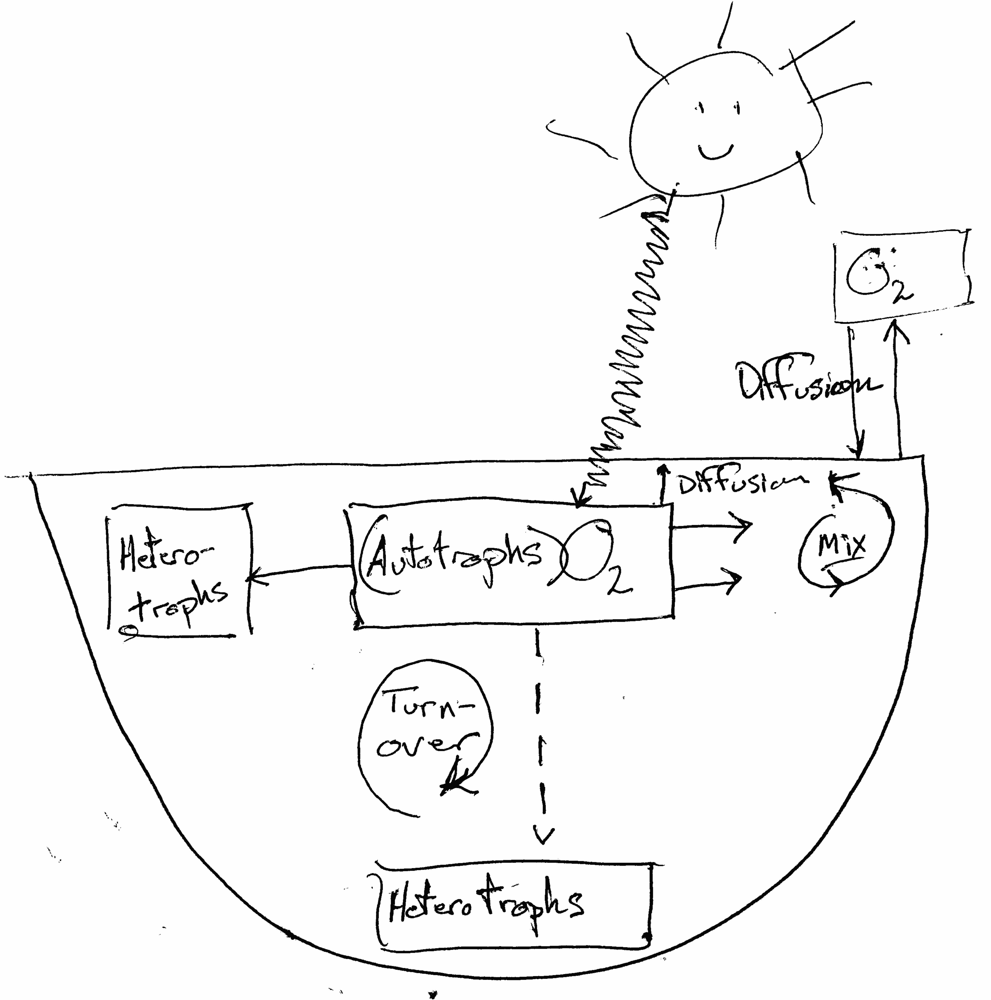

# Lake Metabolism

In this chapter, you'll study how lakes breath. You'll get real data from Acton Lake, graph the data to see what it looks like, and then measure the rate of an inhale and an exhale. You'll do a simple, small example to get the idea of what to do, and then use an R package, `LakeMetabolizer`, to do the same thing and much more.

```{r fig.cap="*We can use lake oxygen level to measure net ecosystem production. *", out.width="70%", echo=FALSE}

```

## Estimating Productivity

Most cells respire to do the work of growth and maintenance by consuming oxygen and using it as the final electron acceptor when O$_2$ is reduced, creating water. Because individuals comprise cells, and ecosystems comprise individuals, ecosystems respire too, and we can measure their metabolic rate using oxygen consumption and production.^[Just remember: ecosystems are peole, too. You respire, and lakes respire.]

We measure whole ecosystem metabolic rate as *net ecosystem productivity* (NEP), which is the difference between gross primary productivity (GPP) and respiration (R). Recall that production and respiration result mostly from the processes of building carbon-rich molecules (anabolism) and burning carbon-rich molecules (catabolism). These processes use lots of carbon, hydrogen, and oxygen, and thanks to strict stoichiometric constraints, we can track just one of those elements to measure the entire pair of processes.

If we put all of these in the same units of oxygen allows us to measure the rate,
$$NEP = GPP - R_{\mathrm{total}}$$
where $R_{\mathrm{total}}=R_A+R_H$, that total respiration is the sum of respiration by autotrophs and heterotrophs. Limnologists assume that, due to stoichiometric relations of acquatic organisms, rates of whole lake photosynthesis, respiration, and net primary production are correlated with rates of change in amount of oxygen dissolve in the water column. Therefore, we can estimate respiration and net primary production by quantifying changes in oxygen concentration over time.  Dissolved oxygen in the water column (DO) is relatively easy to measure, therefore it is relatively easy to estimate NEP. If we assume that respiration is constant throughout the 24 h cycle, we estimate GPP as the sum of NEP and R. This is known are the *free-water dissolved oxygen method* of estimating NEP, R and GPP. Because we think about lake NEP as *metabolism*, we will use units of $R$, $NEP$, and $GPP$ as mg$\cdot$mL$^{-1}$$\cdot$h$^{-1}$.

By tracking DO throughout the daytime and nighttime, we can estimate NEP and R, and then calculate GPP as the sum of NEP and R:

* the rate $R$ is the slope of DO vs. time at nighttime (when photoautrophs stop fixing carbon).
* the rate $NEP$ is the slope of DO vs. time during the day (when photoautrophs are fixing carbon and respiration continues unabated).
* the rate $GPP$ is $GPP = NEP + R_{\mathrm{total}}$ 

## By hand, but in R

Remember to start by loading the `tidyverse` and `deSolve` packages in R.

Let's practice R by importing, wrangling, and graphing data, then calculating slopes and estimating respiration, NPP, and GPP. 

Start by obtaining data for Acton Lake (`acton.csv`). Place it inside a folder labelled 'data' inside your working directory. Here you read in data and check whether it loaded properly.
```{r}
## Either change the path name in this function, or
## make sure you have a folder named 'data' inside your working directory
acton <- read_csv("data/acton.csv", 
                  ## tell R the format of one of your variables
         col_types = cols(date_time = 
                            col_datetime(format = "%m/%d/%y %H:%M")), 
    skip = 1# skips the first line of metadata
    )

# acton <- read_csv("data/acton.csv", 
#                   ## tell R the format of one of your variables
#          col_types = cols(date_time = 
#                             col_character()), 
#     skip = 1 # skips the first line of metadata
#     )
# acton$date_time <- as.POSIXlt(acton$date_time, 
#                               format="%m/%d/%y %H:%M")
# summary(acton$date_time)
# acton <- acton %>%
#   mutate(date_time = mdy_hm(date_time))
# summary(acton)
# library(lubridate)
# date_time <- mdy_hm(acton$date_time)
# summary(date_time)
```

Let's check what kind of data set we have.
```{r}
str(acton)
```

We see that the first column is a special format the R will treat in special ways, because it knows how dates and times work, with a 24 clock, 12 months, per year, etc. The rest of the variables are simple continuous numeric variables.

Let's check our understanding of lake oxygen dynamics by plotting the time series. Ggplot understands what to do with dates.
```{r, fig.cap="Oxygen dynamics from Acton Lake."}
ggplot(acton, aes(x=date_time, y=O_mg.L)) + geom_path() 
```

If we want to calculate the slope of the night time oxygen concentration, then we should identify what the endpoints of "day time" are so that we can do analyses on just daylight or nighttime data.

Working with times in R is a little tricky, because times and dates, periods, durations, and intervals are inherently tricky. The `date_time` variable in the original data set contains all the information, and we extra tidbits from it.
```{r}
# determine day/night intervals in a 24 hour clock
## Sunrise time in June
morning <- 6.25
## sunset time in June
evening <- 21
```

Here we separate the hours and days in our variable called `date_time`, and create new variables that will be more useful. The function `mutate()` changes existing variables to make new ones. Don't sweat the details of *how* we manipulate time variables, just figure out what the new variables are.
```{r}
acton <- acton %>% mutate(
                ## dates, as factors.
                date = as.factor( format(date_time, "%Y-%m-%d", tz="America/New_York") ),
                ## hour in decimal format
                hour.d = as.integer( format(date_time, "%H")) + 
                  as.numeric(format(date_time, "%M"))/60,
                ## just the daylight hours
                daytime.d = 
                  ifelse(hour.d >= morning & hour.d < evening, 
                         hour.d - morning, NA),
                ## just the nighttime hours
                nighttime.d = 
                  ifelse( hour.d >= evening, hour.d-evening, 
                          ifelse(hour.d < morning, 
                                 24 - evening + hour.d, NA)),
                ## an indicator of whether it is day or night
                daylight = as.factor(
                  ifelse(hour.d >= morning & hour.d < evening, "day", "night"))
                )
```

Investigate what we have created thus far.
```{r}
acton[1:5,]
```

(If you would like a spreadsheet-like view of a data frame, RStudio can do that for you. In the upper right panel, select the "Environment" tab. Then select the data frame you would like to see. In addition, you code run the code,
```{r eval=FALSE}
View(acton)
```
which will open the data frame in the upper left panel.)

Next we will identify each 24 hour cycle, starting at sunrise and ending just before sunrise of the next day. Each cycle will be numbered sequentially, 1, 2, ... etc.

```{r}
## identify different day/night cycles, one cycle = one day
## first measurement of the day 
( first <- which(acton$hour.d==6.25) )

## day 1 is in rows 1-96, day 2 is in rows 97-192, etc.
( rows.per.day <- diff(first) )
## there are 96 observations of each cycle
## make a new categorical variable, day
acton <- acton %>%
  mutate(day=as.factor( rep(1:7, each=96)))
```

### Plot one cycle
The slope of oxygen concentration at night is respiration, $R$. The slope of the oxygen concentration during the day is gross primary production minus respiration, or net ecosystem production.

We will pull out one day's worth of data and plot the time series.
```{r fig.cap="One day of the dissolved O$_2$ cycle in Acton Lake, OH, shows evidence of positive NEP during the daytime."}
acton_day1 <- filter(acton, day=="1")
## or 
# library(lubridate)
# acton2 <- filter(acton,  
#                  date_time >=ymd_hms("2013-06-27 06:15:00") & 
#                    date_time <= ymd_hms("2013-06-28 06:00:00") )

ggplot(data=acton_day1, aes(x = date_time, y=O_mg.L) ) +
  geom_path()
```

The nighttime slope is the regression line for just the nighttime data. Here is a picture.

```{r fig.cap="Respiration happens all the time, but we can estimate it as the slope of nighttime O2 concentration per unit time." }
# select the data frame, filter for 'date' values within a range of dates
night1 <- acton_day1 %>% 
  filter( !is.na(nighttime.d) )
ggplot(data=night1, aes(x=nighttime.d, y=O_mg.L)) + 
  geom_path() + geom_smooth(method="lm") + 
  labs("First nighttime O2 levels")
```

Now let's actually use linear regression to measure the slope, which is the rate of decline in O$_2$ levels. We will also measure the rate of change during the daytime as well.
```{r}
night.R <- lm(O_mg.L ~ nighttime.d, data=night1)
## intercept and slope of nighttime regression
coef(night.R)

# as.numeric gets rid of labels
# abs() takes the absolute value
slope.night <- as.numeric( abs( coef(night.R)[2] ))

day1 <- acton_day1 %>% 
  filter( !is.na(daytime.d) )
day.NEP <- lm(O_mg.L ~ daytime.d, data=day1)
## intercept and slope of daytime regression
coef(day.NEP)
# as.numeric gets rid of labels
slope.day <- as.numeric( coef(day.NEP)[2] )
```

What are the *units* of these numbers?

Remember that a slope is the rise over the run, or the change in $y$ divided by the change in $x$.

$$\mathrm{units} \frac{\Delta y}{\Delta x} = \frac{\mathrm{mg\,O}_2 \mathrm{L}^{-1}}{\mathrm{h}}$$

or milligrams O$_2$ per liter per hour.


To calculate time-averaged, 24 hour NEP, we assume that all GPP occurred during the day, whereas respiration is constant throughout the 24 h period. Our daytime is 14 h 45 min, or 14.75, which is only about 61% of one entire 24 h day. 

Here is what we have for hourly rates:
```{r}
# hourly rates
R <- slope.night
NEP <- slope.day
# NEP = fixation - R
# Fixation = GPP = NEP + R
GPP <- NEP + R
```

The hourly rates do not take into account that GPP stops when the sun goes down. The total daily rates have to take into account that respiration happens for 24 h/d, whereas NEP and GPP happen only during the daylight hours, or about 61% of the day.

```{r}
daily.R <- R * 24
daily.NEP <- (NEP * 14.75 - R * 9.25)
daily.GPP <- daily.NEP + daily.R
c(daily.R=daily.R, daily.NEP=daily.NEP, daily.GPP=daily.GPP)
```

So what does this tell us about NEP of Acton Lake on this day?

### Average of all nights
Here is what every night looks like. 
```{r fig.cap="Respiration rate, measured as nighttime slope of O2 vs. time, seems to vary substantially from night to night."}
nights <- filter(acton, daylight=="night")
ggplot(nights, aes(x=nighttime.d, y=O_mg.L, colour=day, linetype=day)) + 
  geom_point() + # plot points
  geom_smooth(method="lm", se=FALSE) # fit linear models each night
```

We can calculate the average slope for all nights, forcing a straight line through each night's data. The estimates of uncertainty and the P values won't make sense because the data are completely autocorrelated, but we can rely on the point estimates of the coefficients, and the average slope, in particular.
```{r}
m.resp <- lm(O_mg.L ~ nighttime.d:day , data=acton)
night.O2.rate <- mean( coef(m.resp)[-1] )
night.O2.rate 
```


The estimate for `night.d`, ```r round(coef(m.resp)[2],3)```, is our estimate of the respiration rate in mg_O$_2$/L per hour. We usually report this per day, which would just be 24 times as great.

Here is what each day looks like. Recall the at daytime oxygen increase is GPP-R or NEP.
```{r fig.cap="NEP rate, measured as daytime slope of O2 vs. time, seems to vary substantially from night to night."}
days <- filter(acton, daylight=="day")
ggplot(days, aes(x=daytime.d, y=O_mg.L, colour=day)) + 
  geom_point() + # plot points
  geom_smooth(method="lm", se=FALSE) # fit linear models each night
```

If we want to, we could throw out the days that have negative slopes, that is, days 6 and 7.
```{r}
acton3 <- filter(acton, !(day == 6 | day == 7) ) # NOT day 6 OR 7
md.resp <- lm(O_mg.L ~ daytime.d:day, data=acton3)
NEP.day <- mean( coef(md.resp)[-1])
NEP.day
```
To get 24 hour NEP, we have to weight daytime and nighttime GPP by the daylength. We stipulated that our morning began at 6:15 AM and ended at 9 PM, or a day time of 14 h 45 min, or about 61% of the 24 h cycle. Also, remember that respiration is positive, even though we are measuring it with a negative slope.
```{r}
R <- as.numeric( abs( night.O2.rate ) )
NEP <- NEP.day 
GPP <- NEP + R # as.numeric drops the element name

daily.R <- R * 24
daily.NEP <- (NEP * 14.75 - R * 9.25)
daily.GPP <- daily.NEP + daily.R
c(daily.R=daily.R, daily.NEP=daily.NEP, daily.GPP=daily.GPP)
```


## The LakeMetabolizer package
Here we do something similar but in a much more sophisticated way. To estimate the net ecosystem productivity, we need to know, at least, gas exchange rates, equilibrium oxygen saturation, the mixing depth, and the daylight hours.

The `metab` function in `LakeMetabolizer` calculates GPP, R, and NEP given requisite data. The function can use several different approaches, depending upon what data you have and your quantitative preferences. Here we use the simplest approach, which the authors refer to as simple bookkeeping. First we load the package and then examine the help page for `metab.bookkeep`. 
```{r eval=TRUE}
# install.packages("LakeMetabolizer", dep=TRUE)
library(LakeMetabolizer)
?metab.bookkeep
```
On the help page you learn about how to use this function. Here we walk through the steps for acquiring or making educated guesses about the data we need.

Here we acknowledge that the change in dissolved oxygen is a function of NEP and also the flux of oxygen due to diffusion,
$$\Delta \mathrm{DO} = \mathrm{NEP}_{t-1} \cdot \Delta t + F_{t-1}$$
where $F_{t-1}$ is the flux of oxygen due to diffusion [@winslow2016a]. This rate of diffusion depends on wind speed, temperature, lake size, and, ultimately, how much the of the lake waters mix [@winslow2016a]. Here we will simply provide a value for the gas exchange constant and a mixing depth.

From its calculations, LakeMetabolizer can give us NEP, R, and GPP. This is because average respiration is the average difference between DO and $F$,  and NEP is the difference between GPP and R. 

LakeMetabolizer needs data in a particular form, and so we build that next.
```{r}
## pick a reasonable gas exchange constant and mixing depth
k.gas <- 0.4
z.mix <- 3 # meters of well mixed surface waters

## let midday PAR be 1300 mol photons/m^2/sec at water surface

## estimate 
### dissolved oxygen at saturation (equilibrium) using the function, o2.at.sat.base()
### irradiance in PAR

acton.LM <- acton %>% 
  mutate(
  do.sat=o2.at.sat.base(temp, altitude=283), #saturated DO
    day= as.numeric(is.day(date_time, lat=39.5)), # day vs. night
  par = 1300 * sin(daytime.d/14.5 * pi), # PAR
  irr = ifelse(is.na(par), 0, par), # recode par to make night = 0
  z.mix = z.mix, # add mixing depth
    k.gas = k.gas, # add gas exchange coefficient
  wtr=temp # rename observed water temperature
  ) %>%
  ## select only some of the columns
  select(datetime=date_time,
         do.obs=O_mg.L, do.sat=do.sat,
         k.gas=k.gas, z.mix=z.mix, irr=irr, wtr=wtr) %>%
  as.data.frame() # simplify the data structure (class tbl_df screws things up)
```

One of the methods in LakeMetabolizer, 'bookkeep', requires irradiance to be 0 or 1. We make a new data set with that.
```{r}
acton.bk <- acton.LM %>%
  mutate(irr = as.numeric( irr>0 ) ) # converts TRUE/FALSE to 1,0
```

Finally, we use three different methods to estimate GPP, R, and NEP.
```{r fig.cap="Estimates of gross and net primary productivity and respiration in Acton Lake, calculated with the `LakeMetabolizer` package suggest problems in blind application of these methods to unfiltered O$_2$ data." }
## calculate GPP, R, NEP in mg O2 / L / day
out.b <- metab(acton.bk, method="bookkeep")
out.k <- metab(acton.LM, method="kalman")
out.m <- metab(acton.LM, method="mle")

## combine data sets - first label each dataset
out.b$method <- "bookkeep"
out.k$method <- "kalman"
out.m$method <- "mle"
## now combine
out.all <- full_join(
  full_join(out.b, out.k),
  out.m)
## ... and stack the variables into a long form
out.l <- out.all %>%
  pivot_longer(cols=GPP:NEP)

ggplot(out.l, aes(doy, value, color=method)) + geom_line() +
  facet_grid(.~name) + labs(y="O2 per liter per day")
```

What about this figure doesn't seem to make sense? Consider definitions of GPP and respiration in your explanation.


