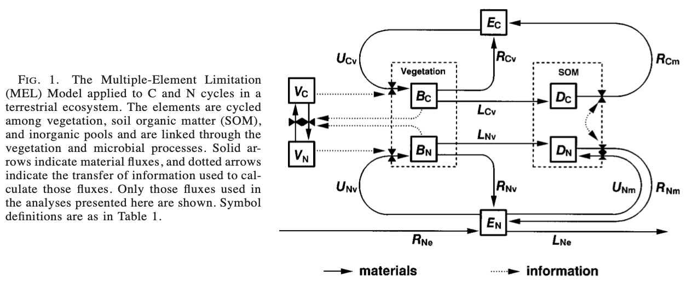
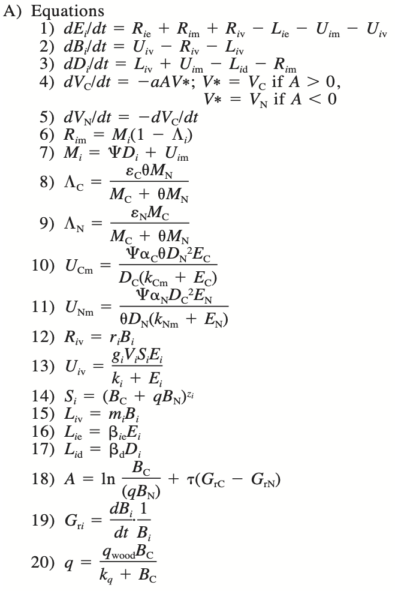
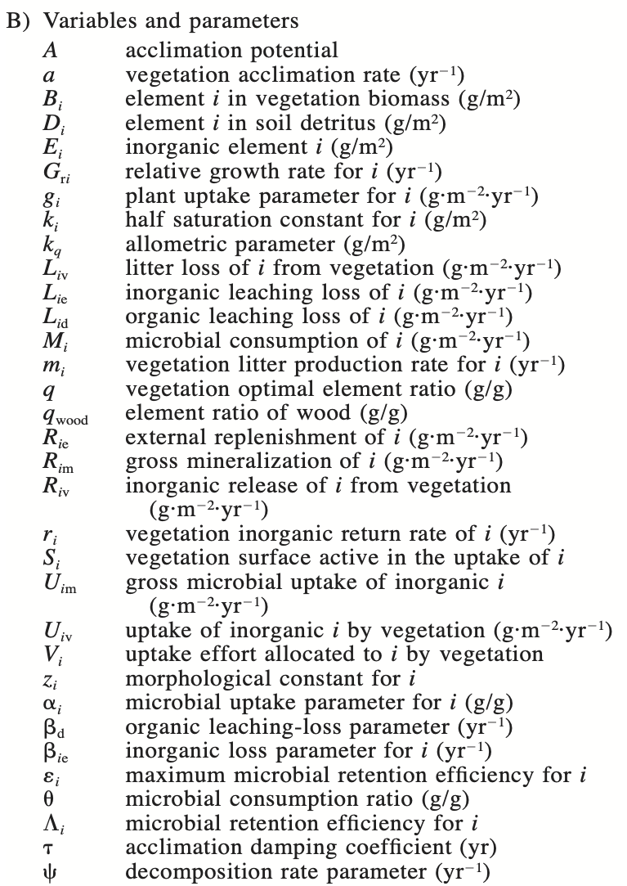
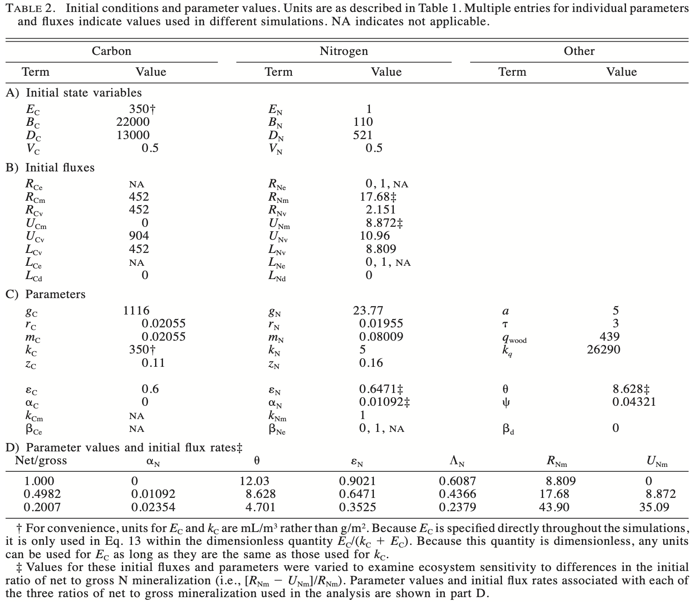

# Multiple Element Limitation {#MEL}

## Rastetter et al. 1997

Readings: 

* Chapters 1, 2
* @bormann1977
* @rastetter:1997aa
* @soetaert2009, pages ...


@rastetter:1992ab proposed a model of multiple-element limitation of vegetation growth (MEL). @rastetter:1997aa extended that to include soil pools. We replicate this here. It is similar to our model of [@bormann1977], but now includes both carbon and nitrogen.^[Rastetter et al. introduce a couple terms that make my skin crawl, and I will do my best to explain them, and avoid them where I can.]

By now, you've had some practice working with models, so take a gander at this one (Fig. \@ref(fig:rf1)). 

```{r rf1, echo=FALSE, fig.cap="*Fig. 1 from Rastetter et al. 1997. Variables $B$, $E$, and $D$ elements in vegetation biomass, inorganic form (e.g., soil solution, or atmospheric CO$_2$), and organic form in soil detritus. Variable $V_i$ is allocation related to nutrient acquistion. $U$ is uptake by vegetation or microbes in detritus (broadly defined). $R$ is renewal into the inorganic pools. $R_{Ne}$ is N deposition from an external source, and $L_{Ne}$ is loss via leaching or denitrification.  The little triangles or bowties on fluxes refer to some rate-controlling function; $B$ and $V$ exchange information (dotted lines) that influences fluxes. Other terms are explained in the Table below.*", out.width='100%' }

```

```{r rt1, echo=FALSE, fig.cap="*Table 1 (Rastetter et al 1997).*", out.width=c("45%", "55%"), fig.show='hold'}


```

MEL uses the parameter $A$ for "acclimation", which we can think of as *compensation* by vegetation that is associated with homeostatic responses to resource supply rates that differ from a stoichiometric ideal. *Acclimation* has a perfectly good meaning in ecophysiology, which is short- to near-term reversible physiological adjustment in response to changing conditions. In MEL, "acclimation" is much broader, and in this early version, it means shifts in the relative rates of C and N accumulation in vegetation, resulting in and from changes in the C:N ratio of vegetation. This occurs due to the ratio of wood to non-woody tissue, defined by $q$.

Compensatory dynamics by vegetation, or "acclimation", is a very important part of this model. "Vegetation" is a complex adaptive system that undergoes diverse changes across many time scales. This could happen through physiological, ecological, and evolutionary changes in plant species composition, ratios of root, stem, leaves and reproductive structures, or changes in tissue C:N ratios. "Acclimation" covers a range of responses with very different time scales, and the variable $A$ is how these changes are incorporated into this ecosystem model. In a later section, we explore the meaning and implications of MEL acclimation.

In MEL, vegetation "acclimates" through differential allocation to carbon vs. nitrogen uptake functions. Rastetter et al. refer to this as uptake "effort". They use this anthropomorphic term "effort" for a pattern of allocation, as in "...increasing uptake effort to acquire limiting soil nutrients." MEL uses the state variables, $V_C$ and $V_N$, to represent this "effort" or allocation of uptake of C and N respectively. In a later section, we explore the meaning and implications of MEL effort.

Both vegetation and microbes acclimate in MEL, in a manner inversely proportion to the relative concentrations of nutrients. In both vegetation and microbes, this results in a tendency toward maintenance of optimal C:N ratios. However, the model handles them differently. It assumes that the acclimation in vegetation is slow while the acclimation in microbes is instantaneous. 


```{r rt2, eval=FALSE, echo=FALSE, fig.cap="*Table 2 (Rastetter et al 1997).*", out.width="90%"}

```

**Exercise** Identify terms or expressions in the model that link the two element cycles (C, N). That is, find expressions that are *functions* of state variables of the two elements. See if you can get a sense of the dependencies. 

**Exercise** Find examples of expression that are linear functions of state variables (Y = aX). Find examples of nonlinear functions of the Michaelis-Menten form (aka Type II functional response) (Y=a X/(k+X)). 

### The model 
Here we write out the model nearly as written in Rastetter et al. (1997), but with some reordering. By default, R is an *interpreted language* rather than a *compiled language*. What that means for us is that R processes commands one line at a time. Therefore, if a function F requires parameter x, we have to make sure parameter x is defined before we use function F. In our implementation of MEL below, `Mc` requires `Ucm`, so `Ucm` needs to be defined before `Mc`.  

Copy this into a new script and name it 'mel2.R'. In that script, add more comments to those I started. Once you have saved your script, you can use `source('mel2.R')` to load the function.
```{r}
mel2 <- function(time, y, p){
  with(as.list(c(y,p)), {
    ## Carbon is 1 and Nitrogen is 2 in 
    ## E - inorganic; D - soil organic w/ microbes; B - veg biomass;  
    ## V - acclimation
    ## Fig. 1 of Rastetter et al. (1997)
   
    ## Gross UPTAKE of inorganic nutrients by Microbes
    ## Note rearrangement of terms (cf. Rastetter et al. 1997)
    ## (uptake) X (carbon availability) X (stoichiometric optimization) 
    Unm <- alpha_n*En/(k_nm + En) * psi*Dc * Dc/(theta*Dn) 
    Ucm <- alpha_c*Ec/(k_cm + Ec) * psi*Dn * (theta*Dn)/Dc  # alpha_c=0
    
    ## Microbial consumption
    ## nutrient availability + gross uptake
    Mc <- psi*Dc + Ucm
    Mn <- psi*Dn + Unm
    
    Lambda_c <- epsilon_c * theta*Mn/(Mc + theta*Mn)
    Lambda_n <- epsilon_n * Mc/(Mc + theta*Mn)
    
  
    ## C:N ratio (units of C)
    q <- q_w*Bc/(k_q + Bc)
    
    ## SURFACE area related to nutrient acquisition (0 < z < 1)
    Sc <- (Bc + q*Bn)^zc
    Sn <- (Bc + q*Bn)^zn
    
    ## UPTAKE by Vegetation
    ## uptake constant X rel. effort X Surface area X resource conc.
    Ucv <- gc * Vc * Sc * Ec/(kc + Ec)
    Unv <- gn * Vn * Sn * En/(kn + En)
    
    ## LOSSES
    Lcv <- mc*Bc 
    Lnv <- mn*Bn
    
    Lce <- beta_ce * Ec # beta_ce = 0 # export = 0
    Lne <- beta_ne * En # leaching or denitrification
    
    Lcd <- beta_d * Dc
    Lnd <- beta_d * Dn
    
    ## REPLENISHMENT to the inorganic pools (R) 
    Rcm <- Mc*(1-Lambda_c) # C respiration
    Rnm <- Mn*(1-Lambda_n) # N mineralization
    Rcv <- rc*Bc
    Rnv <- rn*Bn
    
    ## Available elemental nutrients
    ## Set dE_i/dt = 0 to control the inorganic pools externally
    dE_N <- Rne + Rnm + Rnv - Lne - Unm - Unv
    ## dE_C <- Rce + Rcm + Rcv - Lce - Ucm - Ucv
    dE_C <- 0 
    
    ## Nutrients in vegetation BIOMASS
    dB_C <- Ucv - Rcv - Lcv
    dB_N <- Unv - Rnv - Lnv
    
    ## Nutrients in DETRITUS
    dD_C <- Lcv + Ucm - Lcd - Rcm
    dD_N <- Lnv + Unm - Lnd - Rnm
    
    ## Acclimation (compensation) potential
    ## mass-specific growth rates
    Grc <- dB_C/Bc
    Grn <- dB_N/Bn
    ## symmetric C:N differential plus relative growth difference
    A <- log(Bc/(q*Bn)) + tau * (Grc - Grn)
    
    ## Relative effort toward compensation
    ## if(A>0) Vstar <- Vc else Vstar <- Vn
    Vstar <- (A > 0) * Vc + (A < 0) * Vn 
    dV_C <- -1*a*A*Vstar
    dV_N <- -1 * dV_C
    
    ## AUXILIARY ecosystem variables
    NPP <- Ucv - Rcv
    Net_N_uptake <- Unv - Rnv
    Ecosystem_N=Bn+En+Dn
    Ecosystem_C=Bc+Ec+Dc
    
    return(list(c(dE_C, dE_N, dB_C, dB_N, dD_C, dD_N, dV_C, dV_N),
                NPP=NPP, Net_N_uptake=Net_N_uptake,
                Ecosystem_C=Ecosystem_C) )
  })
}
```

### Parameters
Here we start with a vector of model parameters whose description and units are found in Table 1 above. The numeric values come from Table 2 in Rastetter et al. (1997). You should copy these into your own script, and then add your own comments to each parameter, as I started to.
```{r}
## Parameter set for a closed ecosystem
p.c <- c(
  # carbon, nitrogen
  Rce=0, Rne=0, # no renewal from outside the ecosystem 
  gc=1116, gn =23.77,
  rc=0.02055, rn=0.01955, 
  mc=0.02055, mn=0.08009,
  kc=350, kn=5,
  zc=0.11, zn=0.16,
  epsilon_c=0.6, epsilon_n=0.6471,
  alpha_c=0, alpha_n = 0.01092,
  k_cm = 1, k_nm=1, 
  beta_ce = 0, 
  beta_ne = 0,
  
  # Other
  a=5, 
  tau=3, # damping coef
  q_w=439, 
  k_q=26290,
  theta=8.628,
  psi=0.04321,
  beta_d=0
)
```

**Exercise** To help you better grasp what is going on in the model, redraw Fig. \@ref(fig:rf1) on a chalkboard or a larger piece of paper and add as much detail as you can fit. Include model parameters and definitions and explanations -- whatever helps you make sense of the processes, and their mathematical representation.

## Implementing MEL
Table 2 of Rastetter et al. also include initial values for the state variables, which we include here.
```{r}
init.states <- c(Ec=350, En=1, # Inorganic nutrients g/m^2
            Bc=22000, Bn=110, # Biomass nutrients g/m^2
            Dc=13000, Dn=521, # Detritus nutrients g/m^2
            Vc=0.5, Vn=0.5 # allocation "effort" unitless
            )
```

In addition to initial values of state variables, @rastetter:1997aa (Table 2) list initial fluxes. We don't have to worry about those; the model calculates the initial fluxes from parameters and from initial values of the state variables.

### Increasing atmospheric carbon with events in `ode()`
Rastetter et al. (1997) double CO$_2$ concentrations at an early time point in their simulations. We do that using an `events` in the `ode()` function. 

An "event" in an `ode()` model occurs when the value of a state variable changes suddenly at a one or more time points. In one sense, these are like ecological disturbances. For instance, we could add 1 kilogram of phosphorus to a lake in a one-time pulse, or halve primary producer biomass at 10 random times over a one hundred year interval. 

We can create events using either a function, or with a data frame. Here we create a data frame, using the required four variables: 

* 'var' selects the state variable to change. 
* 'time' is the time at which the event occurs.
* 'value' is the numeric value associated with the change.
* 'method' is the operator that operates on the 'value' and the state variable: 'add' will add the value to the state variable, 'mult' will multiply the state variable by the value, and 'replace' will simply replace the state variable with the value (the value can be a positive or negative number).
```{r}
event.df <- data.frame(var="Ec", time=0.005, value=2, method="mult")
event.df
```
This event will double atmospheric carbon concentration very shortly after the start of the simulation.

We will run the model for 1000 years as in Rastetter et al. (1997), and specify that R return values for a logarithm series of time steps. That way, we see detail in the short term response when the dynamics are quite rapid.
```{r, fig.height=4, fig.width=4}
## 10^3 = 1000 years
t=10^seq(-3, 3, by=.001)
```

Next, we first run the model using parameters for a closed ecosystem, and then for a partly open system [@rastetter:1997aa]. Check with Rastetter et al. to find out what they mean by closed vs. partly open, but I bet you can at least figure out what they mean by a closed system.
```{r}
## Closed ecosystem 
out.c <- ode(init.states, t, func=mel2, parms=p.c,
          events=list(data=event.df) )

## Partly open
p.o <- p.c
p.o["Rne"] <- 1
p.o["beta_ne"] <- 1
out.o <- ode(init.states, t, func=mel2, parms=p.o, 
          events = list(data = event.df) )
```

You will probably get a warning message that R has included our event time into the integration procedure. That is a good thing; if the time we selected for our event was not also a time for which we choose output, `ode` will include it automatically in order to generate the event.

Next we convert the simulation data sets to data frames, add variables, combine, rearrange, and plot the results.
```{r, fig.cap="*Simulated dynamics of carbon and nitrogen in an ecosystem with both C- and N-limitation, in a closed and partly open ecosystem. Recreates Fig. 3 from Rastetter et al. (1997), in part.*", out.width="100%"}

## convert and add a variable
out.c <- out.c %>% as.data.frame() %>% mutate(N.cycle = "closed")
out.o <- out.o %>% as.data.frame() %>% mutate(N.cycle = "open")

## combine "row-bind"
out.all <- rbind(out.c, out.o)

## rearrange to a 'tidy' and long format
outL <- pivot_longer(out.all, cols=-c(time, N.cycle),
                     names_to="State_var", values_to="g.sq.m")

## plot
ggplot(outL, aes(x=time, y=g.sq.m, colour=N.cycle)) + geom_line() + 
  scale_x_log10() + facet_wrap(~State_var, ncol=3, scales="free")
```

Cool, right? Compare this with Figure 3 (Rastetter et al. 1997). What does this leave out?

**Exercise** Create a gradual rise in CO$_2$ using 'events'. Determine a predicted  CO$_2$ scenario, and create a data frame with annual events for the next 100 y.  Compare it to the first 100 years of instantaneous increase. Is this a reasonable comparison?


