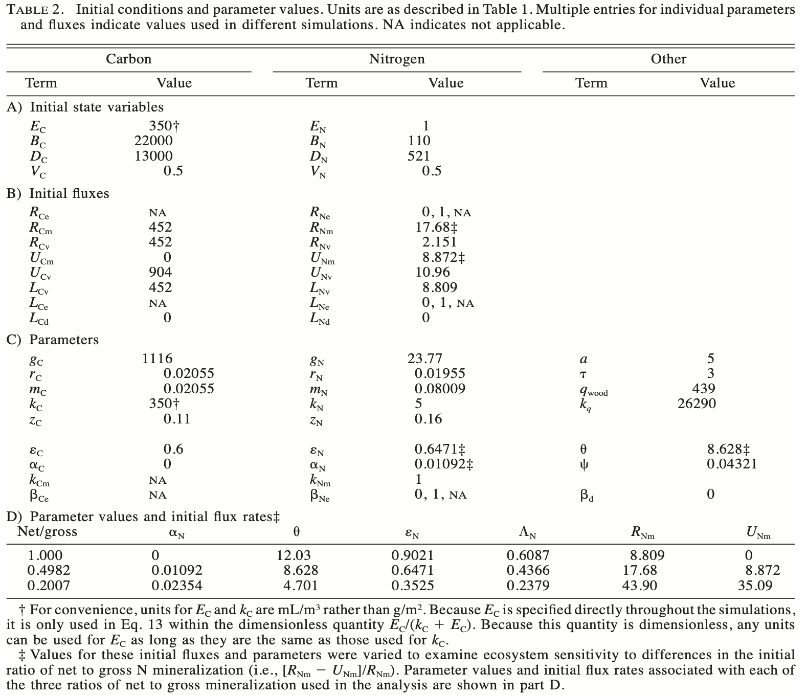

# Multiple Element Limitation {#MEL}

## Rastetter et al. 1997

@Rastetter1992ab proposed a model of multiple-element limitation of vegetation growth (MEL). @Rastetter1997aa extended that to include soil pools. We replicate this here. It is similar to our model of [@Bormann1977], but now includes both carbon and nitrogen.^[Rastetter et al. introduce a couple terms that make my skin crawl, and I will do my best to explain them, and avoid them where I can.]

By now, you've had some practice working with models, so take a gander at this one (Fig. \@ref(fig:rf1)). 

```{r rf1, echo=FALSE, fig.cap="*Fig. 1 from Rastetter et al. 1997. Variables $B$, $E$, and $D$ elements in vegetation biomass, inorganic form (e.g., soil solution, or atmospheric CO$_2$), and organic form in soil detritus. Variable $V_i$ is allocation related to nutrient acquistion. $U$ is uptake by vegetation or microbes in detritus (broadly defined), $R_N$ is deposition, and $L_N$ is loss via leaching or denitrification. $R$ is renewal into the inorganic pools. Other terms are explained in the Table below.*", out.width='100%' }
knitr::include_graphics("figs/Rastetter97-F1.png")
```

```{r rt1, echo=FALSE, fig.cap="*Table 1 (Rastetter et al 1997).*", out.width=c("45%", "55%"), fig.show='hold'}
knitr::include_graphics("figs/Rastetter97-T1a.png")
knitr::include_graphics("figs/Rastetter97-T1b.png")
```

MEL uses the parameter $A$ for "acclimation", which we can think of as *compensation* by vegetation. *Acclimation* has a perfectly good meaning in ecophysiology, which is short- to near-term reversible physiological adjustment in response to changing conditions. In MEL "acclimation" means shifts in the relative rates of C and N accumulation in vegetation, resulting in and from changes in the C:N ratio of vegetation. This could happen through physiological, ecological, and evolutionary changes in plant species composition, ratios of root, stem, leaves and reproductive structures, or changes in tissue C:N ratios. "Acclimation" covers a range of responses with very different time scales.

MEL uses the state variables, $V_C$ and $V_N$, to represent *allocation* of uptake of C and N respectively. They use the anthropomorphic term "effort" for this pattern of allocation, as in "...increasing uptake effort to acquire limiting soil nutrients." 

Starting with the parameters.
```{r rt2, echo=FALSE, fig.cap="*Table 2 (Rastetter et al 1997).*", out.width="90%"}

```

```{r}
p <- c(
  # carbon, nitrogen
  Rce=0, Rne=1,
  Rcm=452, Rnm=17.68,
  Rcv=452, Rnv=2.151,
  gc=1116, gn =23.77,
  rc=0.02055, rn=0.01955,
  mc=0.02055, mn=0.08009,
  kc=350, kn=5,
  zc=0.11, zn=0.16,
  epsilon_c=0.6, epsilon_n=0.6471,
  alpha_c=0, alpha_n = 0.01092,
  k_cm = 0, k_nm=1,
  beta_ce=0, beta_ne=0,
  
  # Other
  a=5, 
  tau=3,
  q_w=439,
  k_q=26290,
  theta=8.628,
  psi=0.04321,
  beta_d=0
)


states <- c(Ec=0, En=0, Bc=0, Bn=0, Dc=0, Dn=0, Vc=0, Vn=0)
states <- c(Ec=1, En=1, Bc=1, Bn=1, Dc=1, Dn=1, Vc=1, Vn=1)

```

The model.
```{r}
mel2 <- function(time, y, p){
  with(as.list(c(y,p)), {
    
    ## Carbon is 1
    ## Nitrogen is 2
   
    ##  UPTAKE by Microbes
    Ucm <- psi*alpha_c*theta*Dn^2 * Ec/(Dc*(k_cm + Ec)) 
    Unm <- psi*alpha_n*Dc^2*En/(theta*Dn*(k_nm + En))
    
    Mc <- psi*Dc + Ucm
    Mn <- psi*Dn + Unm
    
    Alpha_c <- epsilon_c*theta*Mn/(Mc + theta*Mn)
    Alpha_n <- epsilon_n*Mc/(Mc + theta*Mn)
    
    ## REPLENISHMENT (R)
    Rcm <- Mc*(1-Alpha_c)
    Rnm <- Mn*(1-Alpha_n)
    Rcv <- rc*Bc
    Rnv <- rn*Bn
    
    ## C:N ratio (units of C)
    q <- q_w*Bc/(k_q + Bc)
    
    ## SURFACE area related to nutrient acquisition (0 < z < 1)
    Sc <- (Bc + q*Bn)^zc
    Sn <- (Bc + q*Bn)^zn
    
    ## UPTAKE by Vegetation
    Ucv <- gc * Vc * Sc * Ec/(kc + Ec)
    Unv <- gn*Vn* Sn * En/(kn + En)
    
    ## LOSSES
    Lcv <- mc*Bc
    Lnv <- mn*Bn
    Lce <- beta_ce * Ec 
    Lne <- beta_ne * En # leaching or denitrification
    Lcd <- beta_d * Dc
    Lnd <- beta_d * Dn
    
    ## Available elemental nutrients
    dE_C <- Rce + Rcm + Rcv - Lce - Ucm - Ucv
    dE_N <- Rne + Rnm + Rnv - Lne - Unm - Unv
    
    ## Nutrients in vegetation BIOMASS
    dB_C <- Ucv - Rcv - Lcv
    dB_N <- Unv - Rnv - Lnv
    Grc <- dB_C/Bc
    Grn <- dB_N/Bn
    
    ## Nutrients in DETRITUS
    dD_C <- Lcv + Ucm - Lcd - Rcm
    dD_N <- Lnv + Unm - Lnd - Rnm
    
    ## Acclimation tendency
    A <- log(Bc/(q*Bn)) + tau * ( Grc - Grn)
    
    ## Compensation (A="acclimation")
    ## If A>0 then Vc else Vn
    Vstar <- (A > 0) * Vc + (A < 0) * Vn 
    dV_C <- -a*A*Vstar
    dV_N <- -dV_C
    
    return(list(c(dE_C, dE_N, dB_C, dB_N, dD_C, dD_N, dV_C, dV_N)))
  })
}
states <- c(Ec=350, En=1, # Inorganic nutrients g/m^2
            Bc=22000, Bn=110, # Biomass nutrients g/m^2
            Dc=13000, Dn=521, # Detritus nutrients g/m^2
            Vc=0.5, Vn=0.5 # allocation "effort" unitless
            )
t=seq(0,100, by=1)
out <- ode(states, t, func=mel2, parms=p)
#out
plot(out)

outL <- out %>% as.data.frame() %>%
  pivot_longer(cols=-time, names_to="State_var", values_to="g.sq.m")
ggplot(outL, aes(x=time, y=g.sq.m)) + geom_line() + 
  facet_wrap(~State_var, nrow=2, scales="free")
```


